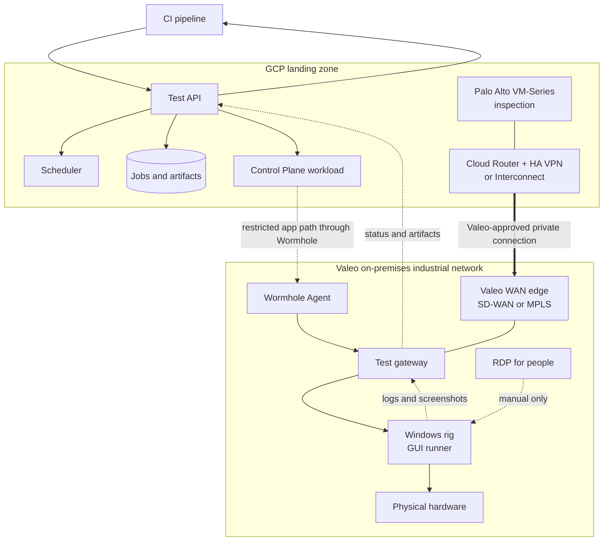

# Remote Test Hardware

Architecture plan for running physical Windows test rigs as a CI service. This repository contains planning only.

## Goal

A CI pipeline requests a test, reserves a compatible test rig, and receives status, logs, and screenshots. GUI and hardware work stay on the assigned Windows machine.

RDP remains available for setup, diagnosis, and recovery. It is not the CI execution path.

## Architecture

Editable diagram: [docs/architecture.drawio](docs/architecture.drawio)

## Hybrid model

The test platform runs in the **GCP landing zone**. Test hardware remains on-premises in the Valeo industrial network.

- The Valeo-approved **SD-WAN/MPLS** path provides corporate network transport to GCP.
- Use **HA VPN (IPsec/BGP)** as the normal encrypted GCP connection, or existing **Dedicated/Partner Interconnect** where Valeo provides it.
- A **Palo Alto VM-Series** in the GCP landing zone is the inspection and policy point, operated to Valeo standards.
- **Wormhole is a separate, application-level path**: Control Plane reaches only the test gateway, not the whole industrial network.
- Do not introduce a direct WireGuard tunnel unless Valeo Network Security explicitly approves it; it must not bypass the landing zone or corporate WAN controls.

This is a hybrid service: cloud control and scheduling, on-premises GUI execution and hardware.

## Keep these roles separate

| Component | Purpose |
|---|---|
| **Control Plane Wormhole Agent** | Private-network connectivity for selected TCP/UDP endpoints. It does not run tests or manage Windows desktops. |
| **Test gateway** | The only local endpoint exposed through Wormhole. It relays jobs and results. |
| **GUI runner** | Runs on the Windows rig: either a Go UI Automation agent or Power Automate Desktop. |
| **RDP** | Human-only setup, diagnosis, and recovery. |

## Operating rules

- One GUI/hardware job per test rig.
- Each job uses an idempotency key, lease, and fencing token.
- A job with an unknown outcome stays `UNKNOWN`; do not blindly rerun it.
- The cloud may reach the gateway, not RDP or arbitrary LAN hosts.
- Run GUI tests only when the selected runner confirms a usable Windows desktop.

## Documents

- [Architecture](docs/architecture.md)
- [Proof of concept](docs/proof-of-concept.md)
- [Five-minute team talk](docs/team-talk.md)
- [Open questions](docs/open-questions.md)
- [Control Plane Wormhole source check](docs/research/control-plane-wormhole.md)
