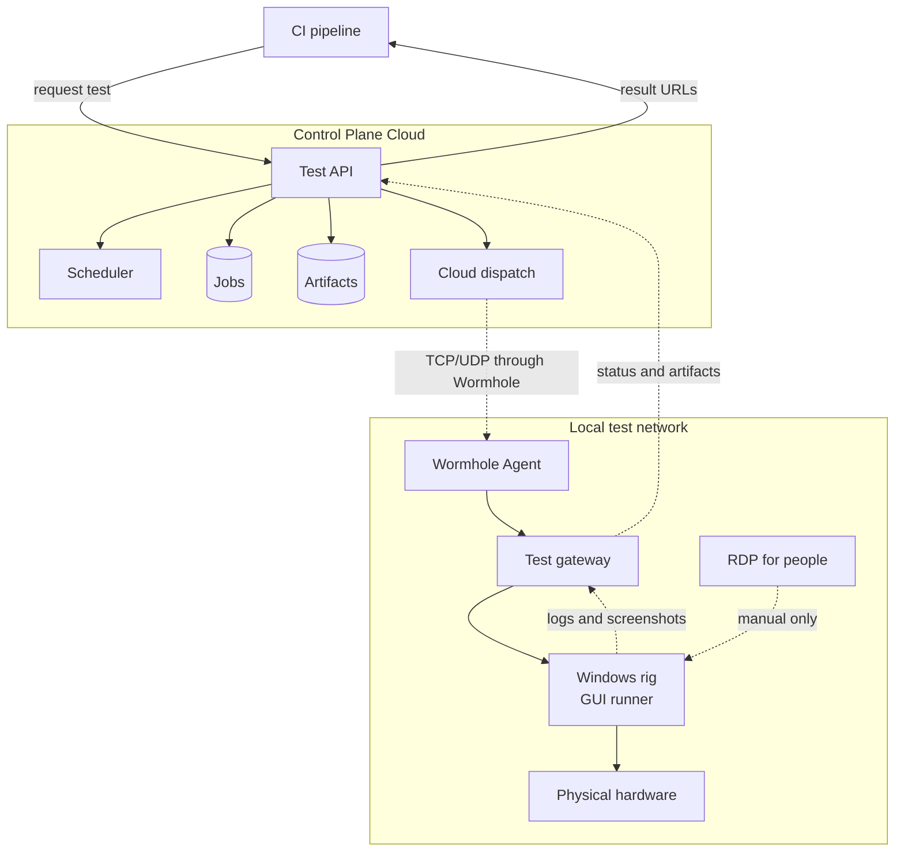

# Remote Test Hardware

Architecture plan for running physical Windows test rigs as a CI service. This repository contains planning only.

## Goal

A CI pipeline requests a test, reserves a compatible test rig, and receives status, logs, and screenshots. GUI and hardware work stay on the assigned Windows machine.

RDP remains available for setup, diagnosis, and recovery. It is not the CI execution path.

## Architecture

Editable diagram: [docs/architecture.drawio](docs/architecture.drawio)

## How on-prem hardware joins the hybrid cloud

The hardware is **not moved into the cloud**. It stays connected to its Windows rig in the local test network.

1. Run the Control Plane Wormhole Agent on a local gateway VM that can reach the test gateway.
2. The Wormhole Agent opens and maintains the secure connection to Control Plane.
3. The cloud workload reaches only the gateway's approved TCP/UDP endpoint through that connection.
4. The gateway relays the reserved job to the Windows GUI runner on the local rig.
5. The runner drives the local GUI and hardware, then sends logs and screenshots back through the gateway.

This makes the test service hybrid: **cloud control plane, on-premises test execution and hardware**.

## Keep these roles separate

| Component | Purpose |
|---|---|
| **Control Plane Wormhole Agent** | Private-network connectivity for selected TCP/UDP endpoints. It does not run tests or manage Windows desktops. |
| **Test gateway** | The only local endpoint exposed through Wormhole. It relays jobs and results. |
| **GUI runner** | Runs on the Windows rig: either a Go UI Automation agent or Power Automate Desktop. |
| **RDP** | Human-only setup, diagnosis, and recovery. |

## Operating rules

- One GUI/hardware job per test rig.
- Each job uses an idempotency key, lease, and fencing token.
- A job with an unknown outcome stays `UNKNOWN`; do not blindly rerun it.
- The cloud may reach the gateway, not RDP or arbitrary LAN hosts.
- Run GUI tests only when the selected runner confirms a usable Windows desktop.

## Documents

- [Architecture](docs/architecture.md)
- [Proof of concept](docs/proof-of-concept.md)
- [Five-minute team talk](docs/team-talk.md)
- [Open questions](docs/open-questions.md)
- [Control Plane Wormhole source check](docs/research/control-plane-wormhole.md)
