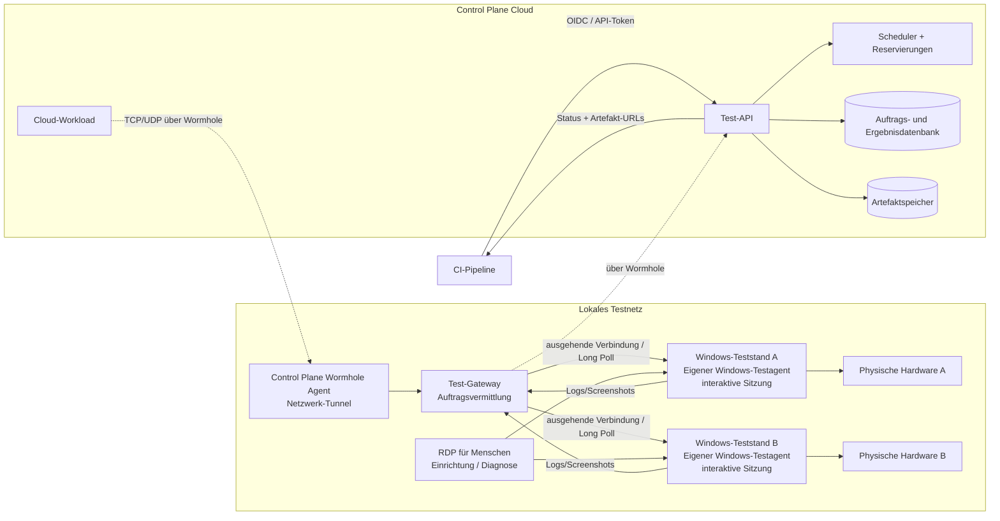

# Remote Test Hardware – Architekturplanung

> **Status:** Diskussions- und Proof-of-Concept-Planung, kein produktiver Code.  
> **Zielgruppe:** Plattform- und Testingenieure

## Ziel

Physische Testhardware an lokalen Windows-Testständen soll als **buchbarer Testdienst** für CI-Pipelines verfügbar werden. Eine Pipeline fordert einen Test an, erhält dessen Status und ruft Logs sowie Screenshots ab. Die Testausführung bleibt dort, wo Hardware und GUI laufen: auf einem zugewiesenen Windows-PC in einer interaktiven Benutzersitzung.

RDP wird **nicht** automatisiert und nicht ersetzt: Es bleibt der Zugang für manuelle Einrichtung, Diagnose und Recovery.

## Nutzen

- Reproduzierbare Hardware-Tests aus CI statt manueller RDP-Schritte
- Exklusive Reservierung vermeidet konkurrierende Zugriffe auf denselben Prüfstand
- Einheitliche Ergebnisse: Status, strukturierte Logs und Screenshots je Auftrag
- Kein eingehender Zugriff aus der Cloud in das lokale Netz nötig (Annahme; im PoC nachweisen)
- Klare Trennung zwischen Cloud-Steuerung, lokaler Netzverbindung und GUI-Ausführung

## Zielarchitektur

## Die entscheidende Trennung

| Baustein | Verantwortung | Nicht verantwortlich für |
|---|---|---|
| **Control Plane Wormhole Agent** | Sichere, persistente Netzwerkverbindung zwischen Cloud-Workload und ausdrücklich erreichbaren privaten TCP/UDP-Endpunkten | Testplanung, Windows-Login, GUI-Automation, Hardwaresteuerung |
| **Unser Windows-Testagent (Option A)** | Holt den reservierten Job, führt GUI-/Hardware-Test in der interaktiven Sitzung aus, sammelt Artefakte | Cloud-Netztunnel oder Wormhole-Betrieb |
| **Power Automate Desktop (Option B)** | Von der Test-API über Dataverse gestarteter Desktop-Flow; führt die GUI aus und meldet Flow-Status/-Ausgaben | Testplanung, Reservierung und Wormhole-Betrieb |
| **Test-Gateway** | Minimale lokale Vermittlungs-API; begrenzt den Tunnel auf einen Dienst und entkoppelt Cloud von PCs | GUI-Ausführung |

Control Plane dokumentiert Wormhole als Verbindung von Cloud-Workloads zu TCP-/UDP-Endpunkten in privaten Netzen. Daraus folgt **nicht**, dass Wormhole Windows-GUI-Tests oder interaktive Sitzungen ausführt. Diese Aufgaben bleiben ausdrücklich bei einem GUI-Runner: entweder unserem Windows-Testagenten (Option A) oder Power Automate Desktop (Option B). Details und Quellen: [Technische Architektur](docs/architecture.md).

## Dokumente

- [Technische Architektur und Ablauf](docs/architecture.md) · [bearbeitbares draw.io-Diagramm](docs/architecture.drawio)
- [Proof of Concept mit Abnahmekriterien](docs/proof-of-concept.md)
- [Fünf-Minuten-Präsentation](docs/team-talk.md)
- [Offene Fragen vor Umsetzung](docs/open-questions.md)
- [Quellennachweis Control Plane Wormhole](docs/research/control-plane-wormhole.md)

## Leitplanken

1. Ein Teststand führt höchstens **einen** Hardware-/GUI-Auftrag gleichzeitig aus.
2. Ein Auftrag besitzt eine idempotente `jobId` und einen **Lease/Fencing-Token**; erneute Zustellung darf nicht zu einer zweiten Hardwareausführung führen.
3. Keine Cloud-Komponente erhält breite Netzsicht auf das LAN: nur das Test-Gateway wird gezielt über Wormhole angesprochen.
4. Bei Verbindungs- oder Agentenausfall ist das Ergebnis **unbekannt**, nicht automatisch erfolgreich oder blind erneut ausführbar.
5. GUI-Tests sind nur zulässig, wenn der gewählte Runner eine vorbereitete, geeignete Windows-Sitzung nachweist.
