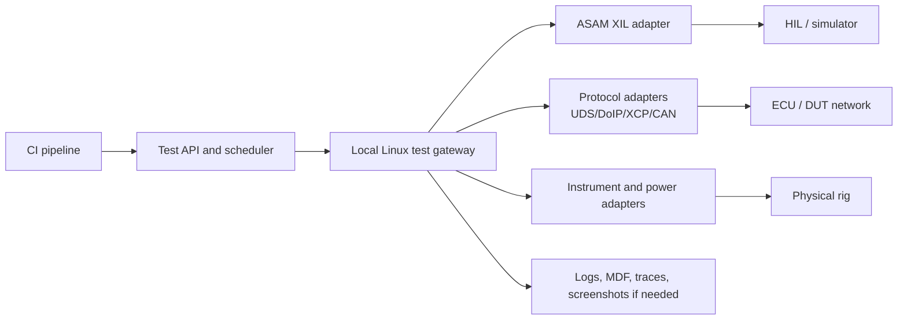

# Linux and API-Driven Alternatives

## Conclusion

Yes. The preferred long-term direction is **API-driven test execution on a local Linux gateway**, not cloud-driven GUI automation.

Keep the Windows GUI runner only as a legacy adapter while the underlying test functions are moved to supported APIs.

## Options

| Option | Fit | Limits | Recommendation |
|---|---|---|---|
| Windows GUI runner | Fastest bridge from the current RDP process | Fragile desktop/session dependency; poor API semantics | Temporary legacy path only |
| Vendor API or CLI | Best first migration where the current test tool exposes a supported interface | Depends on the existing vendor product and licence | Preferred near-term path |
| Linux hardware gateway | Native, headless, API-first execution close to the rig | Every device driver and protocol must be Linux-supported | Preferred target architecture |
| ASAM XIL adapter | Standardised interface between test automation and HIL/MIL/SIL benches | Requires a vendor XIL implementation; OS support is vendor-specific | Preferred for compatible HIL benches |
| Power Automate Desktop | Removes custom GUI automation work | Still Windows/RDP-based; not a Linux or hardware-API solution | RPA fallback only |

## Recommended target

The cloud schedules and stores results. The local Linux gateway owns real-time device access, safety interlocks, timeouts, and fail-safe cleanup. It exposes only approved test templates, never a remote shell.

## Why this fits automotive test environments

### ASAM XIL for HIL abstraction

ASAM XIL is a test-automation API for HIL, SIL, and MIL. It decouples test cases from concrete test benches through vendor-independent abstractions. Its ports cover ECU, diagnostic, electrical-error, network, model, and service-oriented access. This is the strongest option when the HIL supplier has a supported XIL adapter. [1]

### Linux for network-level test control

Linux SocketCAN exposes CAN through the normal socket API and Linux network stack. It is suitable for local API adapters where supported CAN/CAN FD hardware drivers are available. The kernel documentation also describes in-kernel cyclic transmission and receive filtering through the Broadcast Manager. [2]

For measurement/calibration systems, ASAM MCD-3 MC defines a client-server API intended for test-stand automation, automated calibration, and data logging. It can reduce vendor coupling when the existing calibration system offers an implementation. [3]

Use ASAM MDF where the selected bench/toolchain supports it for portable measurement artifacts. [4]

## Design rules

- Keep control loops, bus timing, power switching, and emergency cleanup local to the rig.
- Use signed, versioned test templates with explicit capabilities; no arbitrary commands from CI.
- Give each adapter a narrow responsibility: CAN/DoIP, XCP, HIL, power supply, relay, measurement, or flashing.
- Return structured status, logs, bus traces, and measurement artifacts through the existing job contract.
- Use mTLS device identities and an allow-listed gateway API.
- Isolate the test network from production/plant networks; route only approved test prefixes.
- Preserve the Windows runner as an explicit `legacy-gui` capability, not the default platform path.

## Decision gates

Do not select Linux based on preference alone. For each rig, verify:

1. **Vendor support:** Linux drivers and documented APIs exist for every HIL device, CAN interface, power supply, measurement unit, and flasher.
2. **Protocol coverage:** Required CAN/CAN FD, LIN, FlexRay, Automotive Ethernet, UDS/DoIP, XCP/CCP, and proprietary protocols are available.
3. **Timing:** The local gateway and hardware meet required latency/jitter; cloud links are never in a real-time control loop.
4. **Safety:** Power-off, watchdog, emergency stop, and recovery work locally if cloud, WAN, Wormhole, or gateway connectivity fails.
5. **Traceability:** Test definition, adapter version, firmware, calibration, configuration, logs, and measurement artifacts are retained with the job.
6. **Qualification:** Enterprise quality and safety teams decide whether the chosen tooling needs qualification for its intended use.

## Migration plan

1. Inventory every current GUI action and classify it as vendor API, bus protocol, instrument control, HIL action, or irreducible GUI step.
2. Pick one non-safety-critical test and replace one GUI action with a supported API call.
3. Run Windows GUI and API-driven variants in parallel; compare verdict, traces, and artifacts.
4. Promote the API path only after repeated parity and failure-recovery tests.
5. Keep only remaining irreducible GUI actions on Windows; retire the GUI runner per rig as coverage reaches 100%.

## Sources

1. [ASAM XIL](https://www.asam.net/standards/detail/xil/) — generic test-bench API for HIL/SIL/MIL; accessed 2026-09-23.
2. [Linux SocketCAN](https://docs.kernel.org/networking/can.html) — Linux CAN socket interface; accessed 2026-09-23.
3. [ASAM MCD-3 MC](https://www.asam.net/standards/detail/mcd-3-mc/) — measurement and calibration server API; accessed 2026-09-23.
4. [ASAM MDF](https://www.asam.net/standards/detail/mdf/) — measurement data format; accessed 2026-09-23.
5. [Kvaser CANlib SDK](https://kvaser.com/canlib-webhelp/) — example vendor SDK with C/C++/C#/Python samples; confirm Linux support per selected interface/driver; accessed 2026-09-23.
